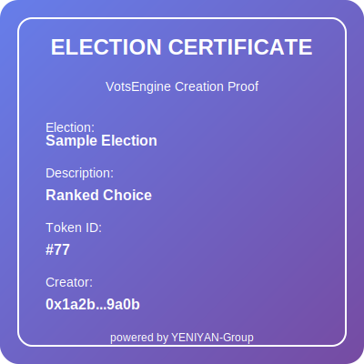

# VotsEngine - Decentralized Voting System

A comprehensive blockchain-based voting system built on Ethereum that ensures transparent, secure, and tamper-proof elections with NFT tokenization.

## 🚀 Overview

VotsEngine is a **proof of concept** smart contract-based voting platform that mirrors traditional voting systems while adding blockchain transparency and security. The system tokenizes elections and provides a complete end-to-end voting solution with external verification capabilities.

This proof of concept demonstrates how traditional electoral processes can be enhanced with blockchain technology, featuring integration with Chainlink Functions for off-chain voter data verification through external APIs. The current implementation connects to a sandbox environment of a verification provider's API to validate voter credentials.

The election model mirrors traditional systems in that it has both **polling officers** and **polling units**. They are both expected to be **physical locations with physical computers customized to perform these operations**. The system **reduces the number of trust points (interception points)** that traditional election systems are attacked from. There is also **instant results when the election ends**.

The system consists of multiple integrated contracts:

- **VotsEngine**: Core contract that manages election creation and acts as a factory
- **Election**: Individual election contracts with comprehensive voting logic
- **VotsElectionNft**: NFT contract that mints commemorative tokens for election creators
- **VotsEngineFunctionClient**: Handles external verification requests using Chainlink Functions

## 🔗 Chainlink Integration Files

The following files implement Chainlink Functions for external voter verification:

- **[VotsEngineFunctionClient.sol](src/VotsEngineFunctionClient.sol)** - Main Chainlink Functions client contract
- **[IVotsEngineFunctionClient.sol](src/interfaces/IVotsEngineFunctionClient.sol)** - Interface for the function client
- **[source.js](server/source.js)** - JavaScript code executed by Chainlink Functions
- **[upload-secrets-1.js](server/upload-secrets-1.js)** - Configuration for Chainlink Functions secrets

> **Note**: The system uses Chainlink Functions to connect with external APIs for voter verification in a sandbox environment.

## ✨ Features

### Core Functionality
- **Election Creation**: Create multiple elections with unique identifiers
- **NFT Minting**: Automatic NFT minting to election creators as proof of ownership
- **Voter Registration**: Register voters with matriculation numbers
- **Candidate Registration**: Register candidates across multiple categories
- **Voter Accreditation**: Polling officers at physical locations can accredit registered voters with optional external verification
- **Secure Voting**: Accredited voters can cast votes through polling units at designated physical locations
- **Instant Results**: Track election statistics and results with immediate availability when election ends
- **Winner Determination**: Automatic winner calculation with tie handling

### Security Features
- **Role-based Access Control**: Distinct roles for polling officers and units at physical locations
- **State Management**: Elections progress through OPENED → STARTED → ENDED states
- **Duplicate Prevention**: Protection against duplicate voters and candidates
- **Time-based Controls**: Elections automatically start and end based on timestamps
- **Validation Checks**: Comprehensive input validation and error handling
- **External Verification**: Optional integration with external identity verification systems
- **Reduced Trust Points**: Minimizes traditional election attack vectors by eliminating multiple interception points
- **Physical Infrastructure**: Utilizes customized computers at designated physical polling locations

### Advanced Features
- **Multi-category Elections**: Support for elections with multiple position categories
- **Tie Handling**: Automatic detection and reporting of tied results
- **Election Tokenization**: Each election gets a unique token ID for reference
- **NFT Integration**: Election creators receive commemorative NFTs with election metadata
- **Comprehensive Statistics**: Detailed voter and candidate analytics
- **Event Logging**: All major actions emit events for transparency
- **Chainlink Functions Integration**: Off-chain voter verification through external APIs
- **Sandbox Environment**: Current implementation uses sandbox API environment for testing verification processes
- **Instant Result Delivery**: Immediate result availability upon election conclusion without manual counting or compilation

## 📋 Prerequisites

- Solidity ^0.8.21
- OpenZeppelin Contracts (for Ownable functionality)
- Ethereum development environment (foundry)
- Chainlink Functions (for external verification)

## 🛠 Installation

1. Clone the repository:
```bash
git clone https://github.com/yeniyan-group/vots_smart_contract.git
cd vots_smart_contract
```

2. Install dependencies:
```bash
make install
```

3. Compile contracts:
```bash
forge build
```

## 🌐 Live Deployment

The VotsEngine contract is currently deployed and live on multiple testnets:

### Sepolia Testnet
**VotsEngine Contract**: `0xBdAc4C73AdFF22977cA7C8E71D0cb49566147C41`

**NFT Contract**: `0x2482E5690D3AF17986a8D17fD847ff444Baa6Ce9`

**Network**: Sepolia Testnet
- **Chain ID**: 11155111
- **VotsEngine Block Explorer**: https://sepolia.etherscan.io/address/0xBdAc4C73AdFF22977cA7C8E71D0cb49566147C41
- **NFT Contract Block Explorer**: https://sepolia.etherscan.io/address/0x2482E5690D3AF17986a8D17fD847ff444Baa6Ce9

### Fuji Testnet (Avalanche)
**VotsEngine Contract**: `0xed7eA5221041A1982d9d257c9617B1448032838d`

**NFT Contract**: `0x34E431C0A1802AA8D559ccd562e97b4906e77863`

**Network**: Fuji Testnet
- **Chain ID**: 43113
- **VotsEngine Block Explorer**: https://testnet.snowtrace.io/address/0xed7eA5221041A1982d9d257c9617B1448032838d
- **NFT Contract Block Explorer**: https://testnet.snowtrace.io/address/0x34E431C0A1802AA8D559ccd562e97b4906e77863

### Interacting with the Live Contract

You can interact with the deployed contract using:

1. **Etherscan Interface**: Visit the contract on Sepolia Etherscan to read contract state
2. **Web3 Libraries**: Connect using ethers.js or web3.js
3. **Frontend Applications**: Build dApps that interact with the contract

```javascript
// Example using ethers.js with Sepolia
const sepoliaContractAddress = "0xBdAc4C73AdFF22977cA7C8E71D0cb49566147C41....";
const VotsEngineSepoliaClient = new ethers.Contract(sepoliaContractAddress, abi, sepoliaProvider);

// Example using ethers.js with Fuji
const fujiContractAddress = "0xed7eA5221041A1982d9d257c9617B1448032838d";
const VotsEngineFujiClient = new ethers.Contract(fujiContractAddress, abi, fujiProvider);

// Get total elections count
const totalElections = await VotsEngineSepoliaClient.getTotalElectionsCount();
```

## 📖 Usage

### Physical Infrastructure Requirements

The VotsEngine system requires a **hybrid physical-digital infrastructure**:

- **Polling Officers**: Stationed at physical locations with customized computers for voter accreditation
- **Polling Units**: Separate physical locations with specialized hardware for vote casting
- **Customized Hardware**: Dedicated computers configured specifically for election operations
- **Secure Network**: Reliable internet connectivity at all polling locations
- **Physical Security**: Standard election security measures at all designated locations

### Deploying the System

The VotsEngine is already deployed on multiple testnets:
- **Sepolia**: `0xBdAc4C73AdFF22977cA7C8E71D0cb49566147C41....`
- **Fuji (Avalanche)**: `0xed7eA5221041A1982d9d257c9617B1448032838d`

For local development or custom deployments:
```solidity
// Deploy the complete system
VotsElectionNft nftContract = new VotsElectionNft();
CreateElection electionCreator = new CreateElection();
VotsEngine votsEngine = new VotsEngine(address(electionCreator), address(nftContract));
```

Or connect to the existing deployments:
```javascript
// Connect to Sepolia deployment
const VotsEngineSepoliaClient = new ethers.Contract(
    "0xBdAc4C73AdFF22977cA7C8E71D0cb49566147C41....", 
    VotsEngineABI, 
    sepoliaProvider
);

// Connect to Fuji deployment
const VotsEngineFujiClient = new ethers.Contract(
    "0xed7eA5221041A1982d9d257c9617B1448032838d", 
    VotsEngineABI, 
    fujiProvider
);
```

### Creating an Election

When you create an election, you automatically receive an NFT as proof of ownership:

```solidity
// Prepare election parameters
IElection.ElectionParams memory params = IElection.ElectionParams({
    startTimeStamp: startTimestamp,
    endTimeStamp: endTimestamp,
    electionName: "Student Union Election 2024",
    description: "Annual student union election for leadership positions",
    candidates: candidates,
    voters: voters,
    pollingUnits: pollingUnits,
    pollingOfficers: pollingOfficers,
    categories: categories
});

// Create election (NFT is automatically minted to msg.sender)
VotsEngine.createElection(params);
```

### External Verification Integration

The system supports external verification through Chainlink Functions, demonstrating how traditional voter validation can be integrated with blockchain systems:

```solidity
// Send verification request for voter (connects to sandbox API)
bytes32 requestId = VotsEngine.sendVerificationRequestForElection(
    ninNumber,        // National ID number
    firstName,        // Voter's first name
    lastName,         // Voter's last name
    voterMatricNo,    // Voter's matriculation number
    slotId,          // Chainlink Functions slot ID
    version,         // Chainlink Functions version
    electionTokenId, // Election token ID
    subscriptionId   // Chainlink subscription ID
);
```

**Note**: The current implementation uses a sandbox environment for API verification, making it suitable for testing and demonstration purposes.

For detailed Chainlink Functions setup, see the [Chainlink integration files](#🔗-chainlink-integration-files) listed above.

### Voting Process

1. **Accredit Voter** (Polling Officer at physical location):
```solidity
VotsEngine.accrediteVoter("MAT001", electionTokenId);
```

2. **Cast Vote** (Polling Unit at designated physical location):
```solidity
IElection.CandidateInfoDTO[] memory votes = [
    IElection.CandidateInfoDTO("Alice Johnson", "CAN001", "President")
];
VotsEngine.voteCandidates("MAT001", "John Doe", votes, electionTokenId);
```

3. **Get Instant Results** (Available immediately when election ends):
```solidity
IElection.ElectionWinner[][] memory winners = VotsEngine.getEachCategoryWinner(electionTokenId);
```

## 📊 Contract Architecture

### VotsEngine Contract
- Manages multiple elections
- Acts as a factory for Election contracts
- Provides unified interface for all election operations
- Maintains election registry with token IDs
- Integrates with NFT contract for tokenization
- Eliminates traditional trust points and interception vulnerabilities

### Election Contract
- Handles individual election logic
- Manages voters, candidates, and voting process
- Implements state transitions and validations
- Calculates results and determines winners
- Provides instant result availability upon election conclusion

### VotsElectionNft Contract
- ERC-721 compliant NFT contract
- Mints commemorative tokens for election creators
- Stores election metadata on-chain
- Provides proof of election ownership

### VotsEngineFunctionClient Contract
- Handles Chainlink Functions integration
- Manages external verification requests through off-chain APIs
- Processes verification responses from external systems
- Bridges on-chain and off-chain data validation
- **Current Implementation**: Connected to sandbox environment of verification API for proof of concept testing

## 🎨 NFT Features

### Automatic Minting
- NFTs are automatically minted when elections are created
- Each NFT represents ownership of a specific election
- Metadata includes election name, description, and timestamps

### NFT Design Sample
The system generates unique NFTs for each election with custom artwork:



### Metadata Structure
```json
{
  "name": "Election NFT #1",
  "description": "Student Union Election 2024",
  "election_name": "Student Union Election 2024",
  "start_time": 1703980800,
  "end_time": 1704067200,
  "token_id": 1
}
```

## 🔐 Security Considerations

### Trust Point Reduction
The system significantly reduces traditional election vulnerabilities by:
- **Eliminating ballot box tampering**: Votes are recorded directly on blockchain
- **Removing manual counting errors**: Automated on-chain tallying
- **Preventing result manipulation**: Immutable vote records
- **Eliminating transmission vulnerabilities**: Direct blockchain storage
- **Reducing human intervention points**: Automated processes where possible

### Access Control
- Only VotsEngine can interact with Election contracts
- Function client has specific permissions for verification
- Polling officers at physical locations can only accredit voters
- Polling units at designated locations can only process votes
- Addresses cannot have multiple roles

### Validation
- Comprehensive input validation
- Duplicate prevention mechanisms
- State-based operation restrictions
- Time-based access controls
- External verification integration

### Transparency
- All operations emit events
- Immutable vote records
- Public result verification
- Open-source smart contracts
- NFT proof of election creation
- Instant result availability eliminates delayed reporting vulnerabilities

## 📚 API Reference

### VotsEngine Functions

#### Election Management
- `createElection()` - Create a new election (mints NFT automatically)
- `getTotalElectionsCount()` - Get total number of elections
- `getAllElectionsSummary()` - Get summary of all elections
- `updateElectionState()` - Update election state based on timestamps

#### Voting Operations
- `accrediteVoter()` - Accredit a voter for voting (performed at physical polling officer location)
- `voteCandidates()` - Cast votes for candidates (performed at physical polling unit location)
- `sendVerificationRequestForElection()` - Request external voter verification

#### Validation Functions
- `validateVoterForVoting()` - Validate voter eligibility
- `validateAddressAsPollingUnit()` - Check polling unit authorization
- `validateAddressAsPollingOfficer()` - Check polling officer authorization

#### Data Retrieval
- `getElectionInfo()` - Get basic election information
- `getElectionStats()` - Get comprehensive election statistics
- `getAllVoters()` - Get all registered voters
- `getAllCandidates()` - Get all candidates with results
- `getEachCategoryWinner()` - Get winners for each category (available instantly when election ends)
- `getElectionAddress()` - Get election contract address
- `getElectionTokenId()` - Get token ID by election name

#### Administrative Functions
- `setFunctionClient()` - Set the function client address (owner only)
- `getOwner()` - Get contract owner
- `getFunctionClient()` - Get function client address
- `getNFTAddres()` - Get NFT contract address

### Election Functions

#### Voter Management
- `getAllVoters()` - Get all registered voters
- `getAllAccreditedVoters()` - Get accredited voters
- `getAllVotedVoters()` - Get voters who have voted

#### Results
- `getAllCandidates()` - Get candidates with vote counts
- `getEachCategoryWinner()` - Get category winners (instantly available)

## 🎯 Use Cases

This proof of concept demonstrates potential applications across various sectors:

- **Academic Institutions**: Student union elections, faculty elections with physical polling stations
- **Corporate Governance**: Board elections, shareholder voting with designated voting locations
- **Community Organizations**: Member elections, policy voting at community centers
- **Political Elections**: Local government, party primaries (with production-ready verification APIs and secure polling infrastructure)
- **DAO Governance**: Decentralized organization voting with hybrid physical-digital approach
- **Collectible Elections**: NFT-backed election memorabilia with instant result delivery

**Current Status**: The system is in proof of concept phase, utilizing sandbox APIs for verification testing. Production deployment would require integration with certified verification providers and establishment of secure physical polling infrastructure.

## 🚨 Error Handling

The system includes comprehensive error handling for common scenarios:

- Invalid timestamps
- Duplicate registrations
- Unauthorized access attempts
- Invalid election states
- Missing required data
- Voting violations
- Function client not set
- Election not found
- Physical location connectivity issues
- Hardware authentication failures

## 🤝 Contributing

1. Fork the repository
2. Create a feature branch (`git checkout -b feature/amazing-feature`)
3. Commit your changes (`git commit -m 'Add some amazing feature'`)
4. Push to the branch (`git push origin feature/amazing-feature`)
5. Open a Pull Request

## 📝 License

This project is licensed under the MIT License - see the [LICENSE](LICENSE) file for details.

## 👨‍💻 Author

**Ayeni-yeniyan** - *Smart Contract Developer*

## 🙏 Acknowledgments

- OpenZeppelin for secure contract templates
- Chainlink for decentralized oracle network
- Ethereum community for development tools
- Contributors and testers

## 📞 Support

For questions, issues, or contributions, please:
- Open an issue on GitHub
- Contact the development team
- Review the documentation

---

**Note**: This is a **proof of concept** smart contract system that demonstrates how traditional voting systems can be enhanced with blockchain technology and transparency. The system mirrors traditional election infrastructure with physical polling officers and polling units using customized computers, while significantly reducing trust points and providing instant results. The system currently uses sandbox APIs for external verification testing. Please ensure comprehensive testing, security audits, establishment of secure physical polling infrastructure, and integration with production-grade verification services before considering any real-world deployment. The NFT integration adds a layer of tokenization and proof of ownership to the election system.